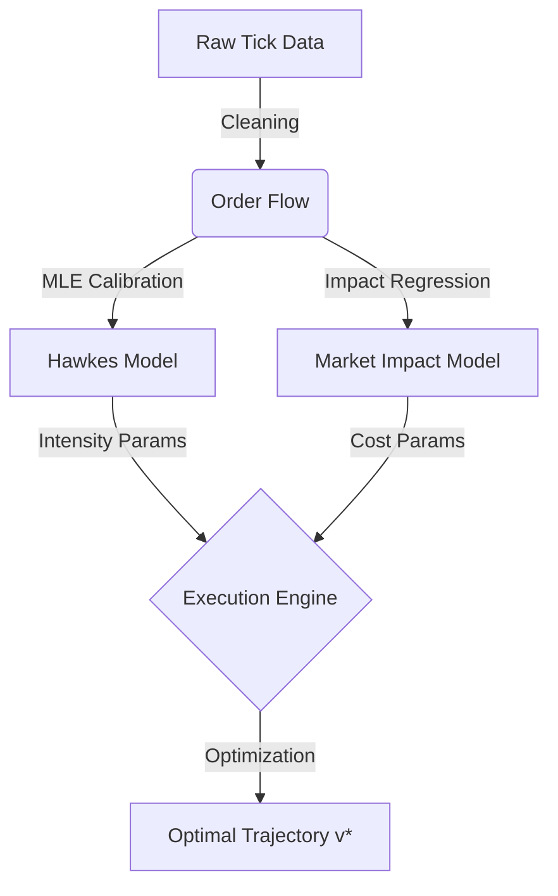

# 📉 Market Microstructure & Optimal Execution
### Quantitative Research on Limit Order Books and Algorithmic Trading

> **"Alpha is found in the microstructure noise."**

This repository houses my personal research notes and Python implementations of seminal papers in **Market Microstructure**. It focuses on **Optimal Execution**, **Price Impact Models**, and **Order Flow Dynamics**.

## 📚 Research Scope

The codebase covers the following theoretical frameworks:

1.  **Almgren-Chriss (2000)**: Optimal liquidation with permanent/temporary impact.
2.  **Hawkes Processes**: Self-exciting point processes for modeling order arrival clustering.
3.  **HJB Framework**: Stochastic control approach to execution (Cartea & Jaimungal).

## 🏗 System Architecture

## 🧠 Mathematical Formulation

The core optimization problem is minimizing the **Implementation Shortfall (IS)** under a risk penalty $\lambda$:

$$\min_{v} \mathbb{E} \left[ \text{Cost} + \lambda \cdot \text{Risk} \right]$$

For the Almgren-Chriss model, the cost function $C(x)$ is defined as:

$$C(x) = \sum_{k=1}^{N} \left( \sigma |x_k| \sqrt{\tau} + \eta \frac{x_k^2}{\tau} \right)$$

where $\eta$ represents the temporary impact coefficient.

## 📦 Code Organization

* `notes/`: LaTeX-heavy derivations of the HJB equations.
* `src/models/`: Production-ready Python classes for simulation.
* `notebooks/`: Jupyter notebooks for visualizing the "Efficient Frontier" of trading.

## 📖 References

* *Almgren, R., & Chriss, N. (2000). Optimal execution of portfolio transactions.*
* *Cartea, A., Jaimungal, S., & Penalva, J. (2015). Algorithmic and High-Frequency Trading.*
* *Bacry, E., et al. (2015). Hawkes processes in finance.*

---
**© 2023 F.WilliamsCA Research.**